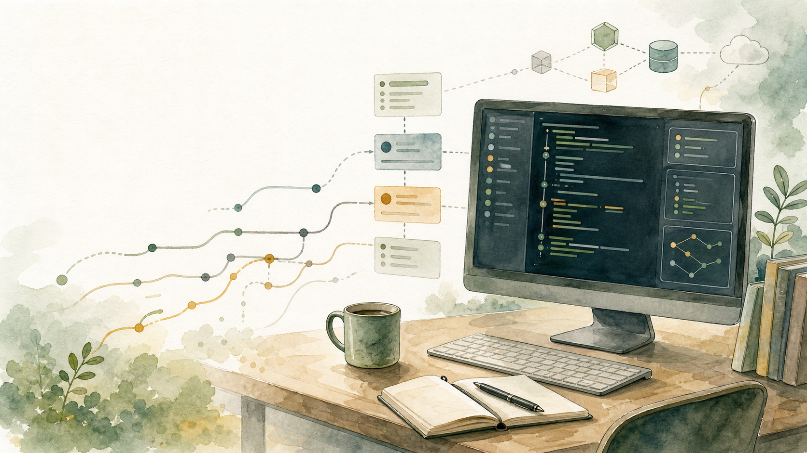

<p align="center">
  
</p>

# go-code

`go-code` is a local-first coding agent for working inside real repositories. It gives you an installable terminal command, a TUI for interactive development, a streamed HTTP runtime, provider and model routing, workspace-aware tool calls, and enough visibility to understand what the agent is doing while it works.

The project is implemented in Go. The public command is `go-code`; the internal module name is still `go-agent-harness` while the product surface settles.

## What You Get

- `go-code`: launch the TUI from any repository.
- `go-code "prompt"`: run one coding prompt and stream the result.
- `go-code --server`: start the local `harnessd` daemon and leave it running.
- A streamed event API for runs, tool calls, model usage, approvals, subagents, conversations, and replay.
- Provider catalog support for OpenAI, Anthropic, Google, DeepSeek, Z.ai, OpenRouter-style routes, and local catalog pricing.
- Workspace-aware execution so the agent works in the project directory where you launched it.

## Quick Start

Clone the repo and install the command into your user-local bin directory:

```bash
git clone https://github.com/dennisonbertram/go-code.git
cd go-code
./scripts/install.sh --add-to-path
```

Open a new shell, or add the printed PATH line for your current shell, then run:

```bash
go-code
```

Common modes:

```bash
go-code                         # interactive TUI in the current project
go-code "summarize this repo"    # single-shot prompt
go-code --server                # persistent local daemon
```

## API Keys

Set the provider keys you plan to use before starting a run:

```bash
export OPENAI_API_KEY="..."
export ANTHROPIC_API_KEY="..."
export GOOGLE_API_KEY="..."
export DEEPSEEK_API_KEY="..."
export ZAI_API_KEY="..."
```

You only need keys for the providers you use. You can also configure provider keys through the TUI and server APIs as the harness evolves.

## Running From Source

For development or debugging, run the server and CLI directly:

```bash
go run ./cmd/harnessd
go run ./cmd/harnesscli -base-url http://127.0.0.1:8080 -prompt "Summarize the repository"
```

Long-running local servers should be started in tmux:

```bash
tmux new-session -d -s go-code-server 'cd /path/to/go-code && go run ./cmd/harnessd'
tmux attach-session -t go-code-server
```

## Repository Map

- `cmd/harnesscli`: command-line client and terminal UI.
- `cmd/harnessd`: local HTTP daemon and runtime bootstrap.
- `internal/harness`: run loop, tools, event emission, and conversation behavior.
- `internal/server`: HTTP API handlers.
- `internal/provider`: provider clients, model catalogs, pricing, and routing.
- `internal/workspace`: local, container, VM, and worktree workspace implementations.
- `catalog/`: model and pricing catalogs used at runtime.
- `prompts/`: bundled prompt assets installed with `go-code`.
- `apps/`: experimental apps that integrate with the harness.
- `benchmarks/`: Terminal Bench and overnight benchmark harnesses.
- `harness_agent/`: Python adapter used by benchmark runners.
- `skills/`: bundled skill fixtures and validation coverage.
- `demo/`: small static demos and smoke-test pages.
- `build/`: container/build packaging assets.
- `testdata/`: shared test fixtures.
- `playground/`: separate-module experiments and training exercises.
- `docs/`: runbooks, design notes, logs, Pages source, and project context.
- `scripts/`: install, development, Symphony, and regression helpers.

The repo root is kept for product entrypoints and project metadata. Scratch snippets and exercises should live under `playground/` or a dedicated test fixture.

## HTTP Surface

The server exposes a streamed coding-agent API. The most commonly used endpoints are:

```text
GET  /healthz
GET  /v1/models
GET  /v1/providers
POST /v1/runs
GET  /v1/runs/{id}/events
POST /v1/runs/{id}/continue
POST /v1/runs/{id}/steer
POST /v1/runs/{id}/compact
POST /v1/runs/{id}/cancel
GET  /v1/conversations/
GET  /v1/skills
GET  /v1/subagents
POST /v1/subagents
```

Run requests support prompt, model, provider, workspace, sandbox, approval, tool, profile, reasoning, and budget fields. Canonical event names live in `internal/harness/events.go`.

## Testing

Focused checks for the install and TUI path:

```bash
bash -n scripts/install.sh scripts/go-code.sh
HOME=$(mktemp -d) GOCACHE=/tmp/go-build go test ./cmd/harnesscli/... -count=1
```

Broader regression:

```bash
GOCACHE=/tmp/go-build ./scripts/test-regression.sh
```

Follow `docs/runbooks/testing.md` for strict TDD expectations, behavior tests, regression tests, and merge gates.

## Documentation

- Public page source: `docs/site/`
- Distribution runbook: `docs/runbooks/distribution.md`
- TUI visual testing: `docs/runbooks/tui-visual-testing.md`
- Symphony issue authoring: `docs/runbooks/symphony-issue-authoring.md`
- Worktree workflow: `docs/runbooks/worktree-flow.md`
- Full docs index: `docs/INDEX.md`

The public project page is:

```text
https://dennisonbertram.github.io/go-code/
```
